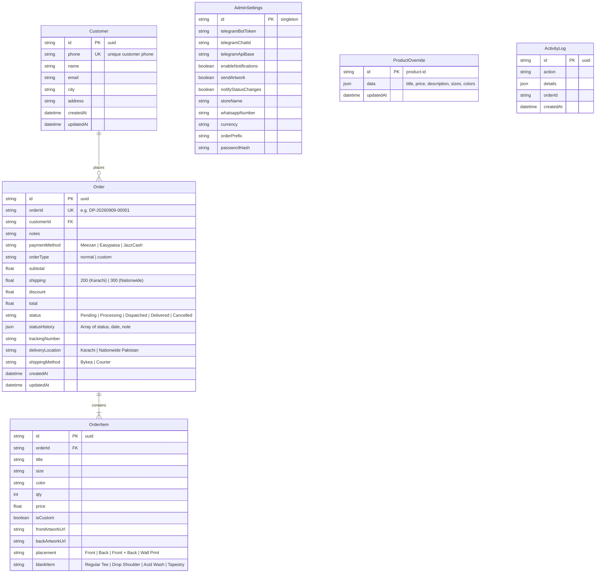

# Deez Prints — Complete Master Architecture & Feature Blueprint

> **Permanent Reference Document**: End-to-end audit of every route, component, product blank, animation, database schema, API endpoint, payment flow, and custom feature in **Deez Prints**.

---

## 1. Executive Summary & Tech Stack

| Domain | Technology / Specification |
| :--- | :--- |
| **Framework** | **TanStack Start** (Fullstack SSR on Vite 8 & Nitro, React 19.2) |
| **Routing** | **TanStack Router** file-based routing (`src/routes/*`) with type-safe route trees |
| **Data Fetching** | **TanStack Query v5** (`QueryClient`, `QueryClientProvider`) |
| **Database & ORM** | **Neon Serverless PostgreSQL** via `@neondatabase/serverless` & **Prisma Client v7** |
| **Styling System** | **Tailwind CSS v4** (`@tailwindcss/vite`, `@import "tailwindcss" source(none)`) with OKLCH color spaces |
| **Animation Engine** | **Motion (framer-motion v12)** (`motion/react`) with spring physics & custom cubic-beziers |
| **Media & CDN** | Dual Cloudinary setups (`dsjnjbsgi` for static assets/site; `okcxaese` for catalog), fallback to `tmpfiles.org` |
| **Typography** | `@fontsource-variable/plus-jakarta-sans` (Display & Sans), `@fontsource-variable/space-grotesk` (Mono) |
| **Email & Alerts** | **Nodemailer v9** (HTML & multipart plain-text) + **Telegram Bot API v2** (via serverless proxy) |
| **Hosting & Deploy** | **Vercel** (`vercel.json`) with automated SSL, HSTS, CSP headers & 301 canonical redirects |
| **Domain** | Canonical: `https://deezprints.com` (redirects `deezprints.store`, `www.deezprints.store`, `deezus.vercel.app`) |

---

## 2. Global Aesthetics & Design System (`src/styles.css`)

### Color Palette (OKLCH Custom Theme)
- **Mood**: High-end brutalist streetwear (Black / Charcoal / Bone White / Burnt Orange Accent).
- `--background`: `oklch(0.145 0 0)` (Pitch Dark Charcoal/Black)
- `--foreground`: `oklch(0.968 0.002 90)` (Bone White)
- `--primary` / `--accent`: `oklch(0.635 0.185 43)` (Burnt Orange)
- `--surface`: `oklch(0.185 0.002 90)`
- `--elevated`: `oklch(0.225 0.003 90)`
- `--ink-0` to `--ink-3`: Layered dark background shades for hero and depth cards

### Typography System
- **Display Typography (`--font-display`)**: Plus Jakarta Sans Variable (Weights 800/900, uppercase, letter-spacing `-0.04em` to `-0.045em`, line-height `0.82`–`0.88`).
- **Body Typography (`--font-sans`)**: Plus Jakarta Sans Variable.
- **Monospace Typography (`--font-mono`)**: Space Grotesk Variable (all badges, technical specs, pricing, dates, and order tags).
- **Special Editorial Fonts** (used on `/about`): `Bebas Neue` & `Permanent Marker`.

### Animations & Micro-Interactions
- **Magnetic Button (`MagneticButton.tsx`)**: Physics-based hover attraction using `useSpring` (`stiffness: 220, damping: 18, mass: 0.4`), transforms button content towards the cursor.
- **Scroll Reveal (`Reveal.tsx`)**: Staggered scroll-triggered fade-up animations (`ease: [0.16, 1, 0.3, 1]`, duration 0.85s).
- **Text Word Reveal (`RevealText`)**: Individual word-level upward wipe transition (`initial: { y: "110%" }`).
- **Hover Image Zoom (`.img-zoom`)**: Smooth scale to `1.1` and `-2deg` rotation on hover with a 700ms custom cubic-bezier.
- **Film Grain Texture (`.grain`)**: SVG fractal noise filter overlay with `mix-blend-mode: overlay` at 0.28 opacity.
- **Infinite Marquee (`.animate-marquee`)**: Continuous 32s horizontal marquee ticker across desktop header and ticker sections.
- **Skeleton Shimmer (`.skeleton`)**: 1.5s infinite linear-gradient shimmer for loading states.
- **Floating Label Inputs (`.float-label`)**: Animated input labels moving to top and shrinking to mono text on focus.
- **Desktop Product Zoom (`DesktopProductDetail.tsx`)**: Interactive mouse-tracking magnification zoom.

---

## 3. Product Catalog, Garment Blanks & Sizing Specifications

### Blanks Architecture (`src/data/site.ts` & `src/data/products.ts`)

#### 1. Acid Wash Tees (`subcategory: "acid-wash"`)
- **Fit**: Hand-dyed vintage heavyweight finish. No two identical.
- **Sizes**: `S`, `M`, `L` (strictly limited to 3 sizes).
- **Chest & Length**:
  - `S`: Chest 19", Length 26"
  - `M`: Chest 20", Length 27"
  - `L`: Chest 21", Length 28"
- **Colors**: `Black` (`#0a0a0a`), `Grey` (`#52525b`), `Maroon` (`#6b1d2f`).
- **Base Price**: Rs. 2,000 – Rs. 3,200.

#### 2. Drop Shoulder Tees (`subcategory: "drop-shoulder"`)
- **Fit**: Relaxed oversized streetwear cut, 240 GSM heavyweight combed cotton.
- **Sizes**: `S`, `M`, `L`, `XL`, `XXL`.
- **Chest & Length**:
  - `S`: Chest 21", Length 27"
  - `M`: Chest 22", Length 28"
  - `L`: Chest 23", Length 29"
  - `XL`: Chest 24", Length 30"
  - `XXL`: Chest 25", Length 31"
- **Colors**: `Black` (`#0a0a0a`), `White` (`#ffffff`), `Grey` (`#52525b`), `Red` (`#dc2626`), `Blue` (`#2563eb`), `Army Green` (`#3f4e38`), `Beige` (`#d6c0b3`), `Brown` (`#5c3d2e`).
- **Base Price**: Rs. 2,200 – Rs. 2,600.

#### 3. Regular Tees (`category: "t-shirts"`, `subcategory: "regular"` / `"graphic"`)
- **Fit**: Classic everyday essential cut, 180 GSM premium cotton.
- **Sizes**: `S`, `M`, `L`, `XL`, `XXL`.
- **Chest & Length**:
  - `S`: Chest 19", Length 26"
  - `M`: Chest 20", Length 27"
  - `L`: Chest 21", Length 28"
  - `XL`: Chest 22", Length 29"
  - `XXL`: Chest 23", Length 30"
- **Colors**: `Black` (`#0a0a0a`), `Charcoal` (`#363636`), `White` (`#ffffff`), `Steel Grey` (`#71717a`), `Navy Blue` (`#1e3a8a`), `Army Green` (`#3f4e38`), `Red` (`#dc2626`), `Beige` (`#d6c0b3`), `Brown` (`#5c3d2e`).
- **Base Price**: Rs. 1,800 – Rs. 2,200.

#### 4. Hoodies (`category: "hoodies"`)
- **Fit**: Fleece-backed winter heavyweight hoodies with kangaroo pouch.
- **Base Price**: Rs. 3,500 – Rs. 4,500.

#### 5. Wall Art & Tapestries (`subcategory: "tapestries"` / `"flags"`)
- **Fabric**: High-definition digital sublimation printed satin fabric wall tapestry with metal grommets.
- **Sizes**: `3x2 ft`, `4x3 ft`, `5x3 ft`, `6x4 ft` (also `24"x36"`, `36"x48"`, `48"x60"`).
- **Base Price**: Rs. 1,600 – Rs. 2,800.

#### 6. Accessories (`category: "accessories"`)
- **Items**: Ceramic graphic mugs (Berserk, Kanye, anime), badges, keychains, wristbands.

### Design Universes & Aesthetic Collections
1. **Anime Archive** (`/collections/anime-archive`): Berserk, Bleach, Blue Lock, Chainsaw Man, Dragon Ball Z, Death Note, Evangelion, Jujutsu Kaisen, Naruto, One Piece, Solo Leveling, Attack on Titan.
2. **Comic Universe** (`/collections/comic-universe`): Marvel, DC, Spider-Man, Batman, Superheroes.
3. **Minimal Drops** (`/collections/minimal-drops`): Subtle chest graphics, clean typography, understated streetwear.
4. **Cinema Collection** (`/collections/cinema-collection`): Pulp Fiction, Fight Club, Drive, Scarface, film legends.
5. **Art Drop** (`/collections/art-drop`): Experimental graphics, album covers, surreal releases.
6. **Street Aesthetic** (`/collections/street-aesthetic`): Bold typography, graffiti, urban grit.

---

## 4. Custom Print Studio (`/custom-print`)

- **Core Capabilities**:
  - Drag-and-drop artwork uploader supporting high-resolution image uploads.
  - Multi-file support: Up to 2 files for clothing (Front, Back, or Front + Back), 1 file for Tapestries.
  - Double-sided add-on fee calculation (+Rs. 500 automatically when 2 artwork files are attached).
  - Dynamic base switcher (Regular Tee, Drop Shoulder, Acid Wash, Tapestry) with live size & color options reacting to base choice.
  - Real-time preview canvas of uploaded artwork.
  - 3-tier resilient upload pipeline via `uploadArtworkToCloudinary`:
    1. Cloudinary unsigned upload (`dsjnjbsgi` / `deez_prints`).
    2. Fallback to anonymous temporary public host `tmpfiles.org`.
    3. Low-res canvas JPEG data URL fallback (ensuring the customer order is NEVER blocked).
  - One-click checkout routing passing `frontArtworkUrl`, `backArtworkUrl`, `placement`, `blankItem`, and notes.

---

## 5. Cart, Checkout & Order Pipeline

### Cart Management (`src/lib/cart.tsx`)
- **Persistence**: `localStorage.getItem("deez-cart-v1")`.
- **Wishlist**: `localStorage.getItem("deez-wishlist-v1")`.
- **Line ID Generation**: Hash composed of `[productId, size, color, note, frontArtworkUrl, placement]`.
- **Toast Notifications**: Interactive toast on add-to-bag without intrusive drawer auto-opening.

### Checkout Wizard (`src/routes/checkout.tsx`)
1. **Step 1: Customer Details & Shipping**
   - Fields: Full Name, WhatsApp/Phone, Email, Complete Address, City, Postal Code, Notes.
   - **Delivery Selection**:
     - **Karachi**: Rs. 200 via Bykea local courier.
     - **Nationwide Pakistan**: Rs. 300 via TCS / Leopards / M&P.
2. **Step 2: Payment Details**
   - Supported options:
     - **Meezan Bank Transfer**: Title `MUHAMMAD HUZAIFA RIAZ`, Account `01890110481675`.
     - **Easypaisa / JazzCash / Zindigi**: Title `MUHAMMAD HUZAIFA RIAZ`, Account `03272487127`.
   - One-tap account number clipboard copy buttons.
3. **Step 3: Order Confirmation & Receipt Generator**
   - Generates high-resolution branded PNG invoice on the fly using `html-to-image`.
   - Generates human-readable Order ID: `DP-YYYYMMDD-XXXXX`.
   - Multi-channel instant dispatch:
     - Saves to Neon PostgreSQL (`saveOrderToDb`).
     - Sends rich Telegram notification with artwork pictures.
     - Sends multipart HTML email notification via Nodemailer.
     - WhatsApp confirmation button opening direct pre-filled chat with studio.

---

## 6. Secret Admin Portal (`/cocnballs`)

- **Security Gate**: Custom PIN / password authentication (Default password `deez123`, hash `1661623862`).
- **Sidebar Views**:
  1. **Dashboard (`DashboardView.tsx`)**: Total revenue, today revenue, monthly revenue, pending orders, custom order %, quick action shortcuts, recent orders table with 1-click status change.
  2. **Orders (`OrdersView.tsx`)**: Complete order table with search by ID, name, phone, city; status tabs (Pending, Processing, Dispatched, Delivered, Cancelled); custom vs normal filters; order details drawer; printable packing slip/invoice; Telegram re-send; CSV & JSON export.
  3. **Products CMS (`ProductsView.tsx`)**: Live product catalog manager. Allows overriding title, price, description, sizes, and colors directly in Neon DB (`ProductOverride` table) without deploying code.
  4. **Analytics (`AnalyticsView.tsx`)**: Revenue trajectories, sales distribution, custom vs normal ratio, city breakdown (Karachi vs Nationwide).
  5. **Telegram Config (`TelegramView.tsx`)**: Live bot token and chat ID configuration, connection test ping, toggle notification alerts, artwork image forwarding.
  6. **Settings & Database (`SettingsView.tsx`)**: Store name, currency, order prefix, WhatsApp number, PIN changer, and 1-click local orders to Neon DB import sync.

---

## 7. Database Architecture (`prisma/schema.prisma`)

---

## 8. Complete Routes Directory

| Route Path | Component File | Description & Purpose |
| :--- | :--- | :--- |
| `/` | `src/routes/index.tsx` | Homepage with hero, ticker, campaign carousel, aesthetic drops, acid wash rows, regular tees, drop shoulder, wall art, Instagram grid. |
| `/collections` | `src/routes/collections.index.tsx` | Shop All page with category chips, sticky filters, sort (Price, A-Z, Featured, Newest), and stats strip. |
| `/collections/$slug` | `src/routes/collections.$slug.tsx` | Individual collection page (Anime Archive, Drop Shoulder, Acid Wash, Comic Universe, etc.) with custom banners. |
| `/products/$productId` | `src/routes/products.$productId.tsx` | Product detail page (Desktop & Mobile split) with interactive color dropdown, size picker, size chart modal, image zoom, apparel accordion, structured schema. |
| `/custom-print` | `src/routes/custom-print.tsx` | Interactive custom printing studio. Multi-file uploader, double-sided print calculation, base item switcher, Cloudinary upload. |
| `/cart` | `src/routes/cart.tsx` | Full-page shopping bag with quantity controls, delivery estimation, and checkout navigation. |
| `/checkout` | `src/routes/checkout.tsx` | 3-step checkout wizard with address capture, Bykea/Courier selector, Meezan & Easypaisa payment details, invoice generator. |
| `/account` | `src/routes/account.tsx` | Customer order history, dispatch tracking lookup, saved wishlist shortcut. |
| `/cocnballs` | `src/routes/cocnballs.tsx` | Protected Admin Portal (Dashboard, Orders, Products CMS, Analytics, Telegram, Settings). |
| `/about` | `src/routes/about.tsx` | Editorial brand story, Karachi studio background, 5-step production process, Bebas Neue typography. |
| `/trust` | `src/routes/trust.tsx` | Quality assurance, DTF & sublimation printing details, fabric guarantees, customer reviews. |
| `/shipping` | `src/routes/shipping.tsx` | Shipping policy (Karachi Rs. 200 Bykea, Nationwide Rs. 300 Courier, 2–3 days prep time notice). |
| `/payments` | `src/routes/payments.tsx` | Complete payment guide (Meezan Bank, Easypaisa, JazzCash, Zindigi account details and copy shortcuts). |
| `/returns` | `src/routes/returns.tsx` | 7-day hassle-free exchange policy, defect handling, WhatsApp exchange link. |
| `/support` | `src/routes/support.tsx` | Customer support center with one-tap WhatsApp launcher and topic cards. |
| `/faq` | `src/routes/faq.tsx` | Categorized FAQ accordion (Shipping, Payments, Returns, Sizing, Production, Custom Printing). |
| `/privacy` | `src/routes/privacy.tsx` | Privacy Policy document. |
| `/terms` | `src/routes/terms.tsx` | Terms of Service document. |
| `/wishlist` | `src/routes/wishlist.tsx` | Customer saved items showcase with quick add-to-bag. |
| `/reviews` | `src/routes/reviews.tsx` | Redirects to home page (`/`). |
| `/sitemap.xml` | `src/routes/sitemap[.]xml.ts` | Server-rendered dynamic XML sitemap with Google Image schemas and DB lastmod timestamps. |
| `/products-feed.xml` | `src/routes/products-feed[.]xml.ts` | Google Merchant Center RSS/XML catalog feed generator. |

---

## 9. Vercel Serverless Endpoints (`api/*`)

1. **`/api/orders` (`api/orders.ts`)**: Direct `@neondatabase/serverless` database client. Handles order creation, customer auto-upserting, status updates, email dispatch via Nodemailer, order deletion, and admin exports.
2. **`/api/products` (`api/products.ts`)**: CRUD endpoints for dynamic product overrides stored in Neon Postgres `product_overrides` table.
3. **`/api/contact` (`api/contact.ts`)**: Contact message handler with dual dispatch (Nodemailer email + fallback).
4. **`/api/telegram` (`api/telegram.ts`)**: Serverless proxy to `https://api.telegram.org` avoiding ISP-level blocks in Pakistan.
5. **`/api/settings` (`api/settings.ts`)**: Admin settings persistence in Neon Postgres.
